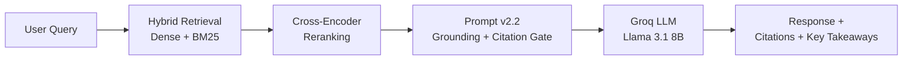

<div align="center">

<!-- Animated header -->


<a href="#">
  
</a>

<br/>


<br/><br/>

<a href="https://github.com/Priyanka-Narang1"></a>
<a href="https://leetcode.com/u/CodingPRos/"></a>

</div>

<br/>

## About

> Engineering reliable software — the kind of systems where retrieval quality, latency, cost, and correctness are measured, not assumed.

I'm a third-year B.Tech student building production-grade AI systems and the backend infrastructure around them: retrieval pipelines, evaluation harnesses, and services designed to be observed, tested, and shipped — not just prototyped in a notebook.

Currently exploring:

- Distributed systems fundamentals
- Backend engineering at scale
- AI infrastructure & LLM serving
- Scalable software architecture

I care more about the engineering *around* a model — retrieval quality, regression gating, observability, cost — than about training the model itself.

<br/>

## Engineering Focus

| Area | Focus |
|---|---|
| **Backend Engineering** | API design, service architecture, deployment reliability |
| **AI Infrastructure** | Retrieval pipelines, vector search, hybrid ranking |
| **LLM Engineering** | Prompt versioning, grounding, citation enforcement, evaluation |
| **Production AI** | Shipping AI features that are tested and monitored, not demoed once |
| **System Design** | Designing for correctness and maintainability first |
| **Distributed Systems** *(learning)* | Building toward systems that scale beyond a single service |

<br/>

## Tech Stack

**Languages**


**Frontend**


**Backend**


**Cloud & DevOps**


<br/>

| Category | Tools |
|---|---|
| Languages | Python, C++, JavaScript, SQL |
| Frontend | React, Next.js, HTML5, CSS3, Tailwind CSS |
| Backend | FastAPI, REST APIs |
| AI / Machine Learning | LangChain, Retrieval-Augmented Generation, scikit-learn, XGBoost, SHAP, TF-IDF |
| LLM Engineering | Hybrid retrieval (dense + BM25), cross-encoder reranking, prompt versioning, LLM-as-judge evaluation, Groq API |
| Databases | ChromaDB, SQL |
| Cloud & Deployment | AWS, Docker, GitHub Actions, Hugging Face Spaces, Render, Netlify, Vercel |
| Software Engineering | Data Structures & Algorithms, API design, system design, software architecture |

<sub>Currently evaluating LLM observability tooling (Langfuse / LangSmith / BrainTrust) for an in-progress project — not yet a shipped part of the stack, so it's tracked under Featured Projects rather than listed above as a used tool.</sub>

<br/>

## Featured Projects

<details open>
<summary><b>🔷 RAG Research Studio</b> — flagship project · production RAG system with CI-gated evaluation</summary>
<br/>

**Overview**
A retrieval-augmented question-answering system over a corpus of RAG research papers, engineered to behave like a real service: versioned prompts, an evaluation suite, and CI that blocks quality regressions before they ship.

**Architecture**


Backend (FastAPI + Docker, deployed on Hugging Face Spaces) and frontend (Next.js + Framer Motion, deployed on Netlify) run as independently deployed services communicating over a versioned API.

**Key Features**
- Hybrid dense + sparse retrieval, reranked before generation
- Strict grounding and citation enforcement — abstains on peripheral matches
- 60-question golden evaluation dataset scored via LLM-as-judge

**Performance**
Faithfulness: 0.91 · Context precision: 0.76 — both gated in CI (thresholds 0.86 / 0.71). A merge that drops below either threshold fails the build.

**Engineering Challenges**
Retrieval occasionally favors a broad survey chunk over the more specific target paper on close-topic queries — an open tuning problem being actively worked on, not hidden. LLM provider was chosen pragmatically around real regional billing/quota constraints, not by default preference.

**Impact**
Backend and frontend both live in production. Now being extended with a dedicated observability layer — tracing, latency/cost/citation-coverage metrics, and automated regression gating — on top of the existing pipeline.

**Technology Stack**
FastAPI · Docker · ChromaDB · BM25 · Groq API · Next.js · Framer Motion · GitHub Actions

**Repository:** [github.com/Priyanka-Narang1/Rag-on-Rag-Papers](https://github.com/Priyanka-Narang1/Rag-on-Rag-Papers)
**Live:** [rag-research-studio.netlify.app](https://rag-research-studio.netlify.app)

</details>

<details>
<summary><b>🔷 Semantic Resume Analyzer</b> — 7-stage hybrid NLP pipeline</summary>
<br/>

**Overview**
A full-stack NLP system that analyzes resumes through a 7-stage hybrid pipeline, combining classical NLP with explainable ML — and the basis of a published Springer LNCS paper.

**Architecture**
spaCy NER → SBERT embeddings → XGBoost scoring → SHAP explainability → TF-IDF features → logistic-regression section scorer → deterministic feedback layer.

**Engineering Challenges**
Deployment required pinning to Python 3.11, resolving spaCy/typer version conflicts, and switching to CPU-only PyTorch to fit within Render's free-tier memory limits.

**Impact**
Deployed full-stack — FastAPI backend on Render, React frontend on Vercel — and formed the basis of a peer-reviewed Springer LNCS publication.

**Technology Stack**
spaCy · SBERT · XGBoost · SHAP · TF-IDF · scikit-learn · FastAPI · React

**Live:** [semantic-resume-analysis.vercel.app](https://semantic-resume-analysis.vercel.app)

</details>

<br/>

## Engineering Philosophy

> Correctness first. Then maintainability, scalability, and observability — in that order.

- **Correctness** — an eval suite exists so "it works" is measured, not assumed
- **Maintainability** — consolidating duplicated logic and drifted constants before adding features
- **Observability** — instrumenting pipelines so failures are traceable, not guessed at
- **Testing** — CI regression gates on quality metrics, not just green checkmarks
- **Developer Experience** — versioned prompts and configs tracked alongside code

<br/>

## Research

**Published Research** — Springer LNCS, as **Corresponding Author**.
The paper is built on the Semantic Resume Analyzer's 7-stage hybrid NLP pipeline.

**Best Presenter** — awarded at the same venue, as a 2nd-year undergraduate.

<br/>

## Certifications

<div align="center">

**Microsoft**


**IBM**


</div>

<br/>

## Coding Profiles

<div align="center">
<a href="https://github.com/Priyanka-Narang1"></a>
<a href="https://leetcode.com/u/CodingPRos/"></a>
</div>

<br/>

## GitHub Analytics

<div align="center">


</div>

<br/>

<div align="center">

</div>

<br/>

## Current Focus

```yaml
learning:
  - Distributed systems
  - High-performance backends
  - LLM infrastructure
  - System design

building:
  - Production-grade AI applications
  - Scalable backend services
  - Developer tools

exploring:
  - AI infrastructure
  - Multi-agent systems
  - Distributed computing
  - Developer experience

open_to:
  - Software Engineering internships
  - AI Engineering internships
  - Backend engineering
  - Open source collaboration
```

<br/>

## Contact

<div align="center">

<a href="https://github.com/Priyanka-Narang1"></a>
<a href="https://www.linkedin.com/in/priyanka-narang1/"></a>
<a href="mailto:narangpriyanka16@gmail.com"></a>
<a href="https://leetcode.com/u/CodingPRos/"></a>

</div>

<br/>


</div>
